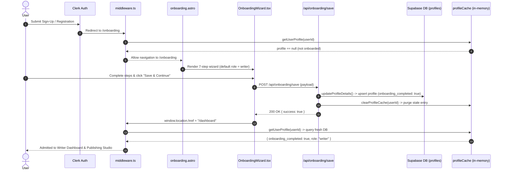

# 🧭 CarcBlog Onboarding Architecture & Codebase Report

This document provides a complete, line-by-line inventory and explanation of every file involved in the **User Onboarding System** in CarcBlog. It details line counts, responsibilities, input/output data structures, and how all components interact across authentication, database storage, and page routing.

---

## 📊 Summary Table of Onboarding Files

| File Path | Lines | Type | Primary Function |
| :--- | :---: | :--- | :--- |
| [`src/pages/onboarding.astro`](file:///d:/carcblog/src/pages/onboarding.astro) | **24** | Astro Page | SSR page route (`/onboarding`) that gates unauthenticated users and mounts the React wizard island. |
| [`src/components/islands/onboarding/OnboardingWizard.tsx`](file:///d:/carcblog/src/components/islands/onboarding/OnboardingWizard.tsx) | **663** | React Component | 7-step interactive UI wizard collecting user identity, role (`writer`/`reader`), professional bio, topics, and social links. |
| [`src/pages/api/onboarding/save.ts`](file:///d:/carcblog/src/pages/api/onboarding/save.ts) | **78** | API Route | Main V2 API endpoint (`POST /api/onboarding/save`) processing full onboarding form submissions into Supabase. |
| [`src/pages/api/onboarding.ts`](file:///d:/carcblog/src/pages/api/onboarding.ts) | **56** | API Route | Lightweight V1 onboarding endpoint (`POST /api/onboarding`) for 1-step profile initialization. |
| [`src/schemas/onboarding.ts`](file:///d:/carcblog/src/schemas/onboarding.ts) | **22** | Zod Schema | Validation rules for the lightweight onboarding endpoint input (`fullName`, `role`, `occupation`, `bio`). |
| [`src/middleware.ts`](file:///d:/carcblog/src/middleware.ts) | **126** | Middleware | Intercepts requests, checks `onboarding_completed` status, enforces `/onboarding` redirects, and gates writer dashboard routes. |
| [`src/lib/profile.ts`](file:///d:/carcblog/src/lib/profile.ts) | **237** | Service Layer | DB queries for profile upserts (`updateProfileDetails`), social link saving, profile completion calculation, and cache invalidation. |
| [`src/lib/supabase.ts`](file:///d:/carcblog/src/lib/supabase.ts) | **424** | Service Layer | Supabase client setup, short-lived in-memory SSR `profileCache`, and `clearProfileCache()` helper. |
| [`src/lib/auth.ts`](file:///d:/carcblog/src/lib/auth.ts) | **79** | Helper | SSR helper (`getCurrentUser`) extracting authenticated user metadata from `Astro.locals.user` or Clerk fallback. |
| [`src/pages/auth/sign-up.astro`](file:///d:/carcblog/src/pages/auth/sign-up.astro) | **21** | Astro Page | Clerk Registration page configured to redirect new users to `/onboarding`. |
| [`src/pages/auth/sign-in.astro`](file:///d:/carcblog/src/pages/auth/sign-in.astro) | **21** | Astro Page | Clerk Login page configured to redirect returning users to `/dashboard`. |

---

## 🔍 Detailed Breakdown of Each File

### 1. [`src/pages/onboarding.astro`](file:///d:/carcblog/src/pages/onboarding.astro)
- **Total Lines**: `24`
- **Location**: `src/pages/onboarding.astro`
- **Purpose**: Server-Side Rendered (SSR) page route accessible at URL `/onboarding`.
- **How it Works**:
  1. Checks `getCurrentUser(Astro.locals)` on the server.
  2. If no authenticated user session is found, redirects to `/auth/sign-in?redirect_url=/onboarding`.
  3. Renders the application shell and mounts `<OnboardingWizard client:load />` React island with initial user values (`id`, `full_name`, `username`, `avatar_url`, `role`).

---

### 2. [`src/components/islands/onboarding/OnboardingWizard.tsx`](file:///d:/carcblog/src/components/islands/onboarding/OnboardingWizard.tsx)
- **Total Lines**: `663`
- **Location**: `src/components/islands/onboarding/OnboardingWizard.tsx`
- **Purpose**: Client-side multi-step wizard component managing interactive form state and user preferences.
- **How it Works**:
  - Contains **7 step screens**:
    - **Step 1 (Basic Profile & Role)**: User selects account type (**Writer / Creator** or **Reader / Explorer**), Full Name, Username, Bio, Tagline, Country, and City. (Defaults to `writer` so creators get full access to publishing studio & AI tools).
    - **Step 2 (Professional Info)**: Job Title, Company, Industry, Years of Experience, Skills list.
    - **Step 3 (Social Links)**: LinkedIn, GitHub, X (Twitter), Portfolio URLs.
    - **Step 4 (Topics & Interests)**: Multi-select topics (AI, SaaS, FinTech, Programming, Dev, Startups).
    - **Step 5 (Creator Follows)**: Recommended creators to follow on launch.
    - **Step 6 (Notification Settings)**: Email digest, comments, likes, follower alerts preferences.
    - **Step 7 (Completion Summary)**: Final confirmation review.
  - Dynamically calculates a **Profile Completion Score** percentage.
  - Sends full JSON payload to `POST /api/onboarding/save`.
  - Upon successful response, reads `redirect_url` query parameter (or defaults to `/dashboard`) and performs `window.location.href` navigation.

---

### 3. [`src/pages/api/onboarding/save.ts`](file:///d:/carcblog/src/pages/api/onboarding/save.ts)
- **Total Lines**: `78`
- **Location**: `src/pages/api/onboarding/save.ts`
- **Purpose**: The primary API route handling full onboarding submission (`POST /api/onboarding/save`).
- **How it Works**:
  1. Authenticates request via `getCurrentUser(context.locals)`. Returns `401 Unauthorized` if unauthenticated.
  2. Extracts and sanitizes form inputs (`role`, `full_name`, `username`, `bio`, `tagline`, `location`, `skills`, `topics`, `social_links`, `notification_prefs`).
  3. Calls `updateProfileDetails(user.id, ...)` with `onboarding_completed: true`.
  4. Calls `saveUserSocialLinks(user.id, social_links)`.
  5. Returns HTTP `200 OK` JSON response: `{ success: true, profile: updatedProfile }`.

---

### 4. [`src/pages/api/onboarding.ts`](file:///d:/carcblog/src/pages/api/onboarding.ts)
- **Total Lines**: `56`
- **Location**: `src/pages/api/onboarding.ts`
- **Purpose**: Lightweight V1 onboarding API route (`POST /api/onboarding`).
- **How it Works**:
  1. Authenticates session via `requireAuth(locals)`.
  2. Validates JSON payload against `onboardingSchema` (Zod).
  3. Resolves username from Clerk session or fallback ID string.
  4. Upserts basic profile record using `upsertUserProfile(userId, profile)`.
  5. Returns HTTP `200 OK` response: `{ success: true, role }`.

---

### 5. [`src/schemas/onboarding.ts`](file:///d:/carcblog/src/schemas/onboarding.ts)
- **Total Lines**: `22`
- **Location**: `src/schemas/onboarding.ts`
- **Purpose**: Zod validation schema for the lightweight onboarding endpoint.
- **Rules**:
  - `fullName`: string, 1 to 100 characters.
  - `role`: enum (`'reader'` | `'writer'`), defaults to `'reader'`.
  - `occupation`: string, 1 to 100 characters.
  - `bio`: optional string, maximum 500 characters.

---

### 6. [`src/middleware.ts`](file:///d:/carcblog/src/middleware.ts)
- **Total Lines**: `126`
- **Location**: `src/middleware.ts`
- **Purpose**: Server-side request interceptor (Clerk middleware) executing on every request.
- **Onboarding Gating Logic**:
  1. **Fetch Profile**: For every authenticated request (`userId`), calls `getUserProfile(userId)` and populates `context.locals.user`.
  2. **Unonboarded Check**:
     ```ts
     const isOnboarded = !!profile?.onboarding_completed;
     if (!isOnboarded) {
       if (!isOnboardingRoute && !isOnboardingApi && !isAuthRoute) {
         return context.redirect(`/onboarding?redirect_url=${encodeURIComponent(pathname)}`);
       }
     }
     ```
  3. **Prevent Re-Onboarding**: If user is ALREADY onboarded (`isOnboarded === true`) and tries to visit `/onboarding` or `/auth/sign-in`, redirects them away to `/dashboard`.
  4. **Writer Route Protection**: Gates writer management routes (`/dashboard/articles`, `/dashboard/analytics`, `/dashboard/drafts`) to users with `role === 'writer'` or `'admin'`.

---

### 7. [`src/lib/profile.ts`](file:///d:/carcblog/src/lib/profile.ts)
- **Total Lines**: `237`
- **Location**: `src/lib/profile.ts`
- **Purpose**: Profile database service module containing Supabase database mutation functions.
- **Key Functions**:
  - `updateProfileDetails(userId, updates)`:
    - Normalizes username string.
    - Calculates profile completion percentage score.
    - Performs Supabase `upsert` on `profiles` table.
    - Retries automatically if username collision occurs.
    - Falls back to V1 column payload if DB schema cache lacks V2 columns.
    - **Calls `clearProfileCache(userId)`** to purge the in-memory SSR cache immediately.
  - `saveUserSocialLinks(userId, links)`: Deletes old social links and inserts updated link records.
  - `getProfileByUsername(username)` / `getProfileByUserId(userId)` / `getProfileStats(userId)`.

---

### 8. [`src/lib/supabase.ts`](file:///d:/carcblog/src/lib/supabase.ts)
- **Total Lines**: `424`
- **Location**: `src/lib/supabase.ts`
- **Purpose**: Supabase JS client configuration and short-lived in-memory profile cache for SSR performance.
- **Key Mechanics**:
  - `profileCache`: In-memory `Map` storing `{ data: Profile, expiresAt: number }` with a 15-second TTL.
  - `clearProfileCache(userId)`: Deletes cached entry from memory so subsequent requests hit Supabase DB directly.
  - `getUserProfile(userId)`: Reads from `profileCache` if fresh, or queries `supabase.from('profiles').select('*').eq('id', userId)`.
  - `upsertUserProfile(userId, profile)`: Helper for upserting profiles and invalidating cache.

---

### 9. [`src/lib/auth.ts`](file:///d:/carcblog/src/lib/auth.ts)
- **Total Lines**: `79`
- **Location**: `src/lib/auth.ts`
- **Purpose**: Authentication helper module for Astro pages and layouts.
- **Key Mechanics**:
  - `getCurrentUser(locals)`: Fast-path returns `locals.user` if populated by middleware. Slow-path queries Clerk `currentUser()` and Supabase `profiles` table.

---

### 10. Auth Pages: [`sign-up.astro`](file:///d:/carcblog/src/pages/auth/sign-up.astro) & [`sign-in.astro`](file:///d:/carcblog/src/pages/auth/sign-in.astro)
- **Total Lines**: `21` each
- **Location**: `src/pages/auth/sign-up.astro` & `src/pages/auth/sign-in.astro`
- **Purpose**: Mount Clerk authentication widgets.
- **Redirection Config**:
  - `sign-up.astro`: `<SignUp forceRedirectUrl="/onboarding" fallbackRedirectUrl="/onboarding" />` ensures new sign-ups are routed straight to `/onboarding`.
  - `sign-in.astro`: `<SignIn fallbackRedirectUrl="/dashboard" />` routes returning users to `/dashboard` (where middleware checks `onboarding_completed`).

---

## 🔄 Complete Step-by-Step Onboarding Execution Flow



---

## 🛠️ Key Architectural Takeaways

1. **Strict Middleware Gating**: `src/middleware.ts` is the single source of truth for gating routes. If `onboarding_completed` is false, it forces the user into `/onboarding`.
2. **Instant Cache Invalidation**: `clearProfileCache(userId)` in `src/lib/profile.ts` prevents 15-second SSR cache stale reads upon form submission.
3. **Role Gating**:
   - `role === 'writer'`: Full access to Writer Dashboard, Publishing Studio, AI Story Assistant, Media Search, Articles & Analytics.
   - `role === 'reader'`: Access to Reader Bookmarks, History, Likes & Followed Creators.
